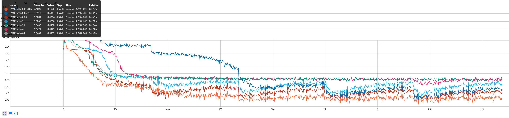
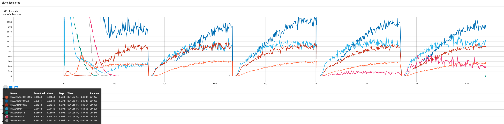
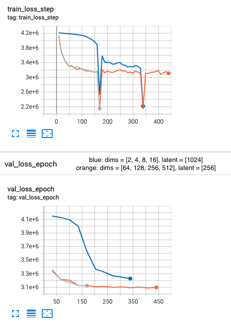

## Initial thoughts
In my case, using `mean` vs `sum` reduction had a huge impact on the reconstruction (even after adjusting the learning rate for both cases). Overall, using `sum` reduction was much more stable and made it easier for the model to learn any other features than just the overall 'color' of the image. It seems, that the `mean` reduction leads to a more generalized and less detailed learning of (smaller) features. 

I think maybe this is related to the connection between the last layer of encoder and latent space. `sum` reduction allows for individual connections between neurons and distributions to grow more easily, whereas using `mean` reduction takes a longer time, to do that.

## Task 1
In `data_exploration.ipynb` is a small case of exploring the images available. There are a few most common examples of images that can be classified: 

- By number of colors: 
    - greyscale images (i.e. `val/0/BEH-261.png`)
    - full-color images (i.e. `val/0/BEH-264.png`)
- By light: 
    - unlit images (i.e. `test/1/PAPILA-330.png`)
    - well-lit images (i.e. `test/0/OIA-ODIR-TEST-OFFLINE-327.png`)
    - with light artifacts, such as a rainbow on the brink of the eye (i.e. `train/1/EyePACS-Glaucoma-37.png`)
- By structure:
    - full eye, no black stripes above/below
    - full eye, with black stripes above/below
    - `eye-error`, where the image of the eye seems to be "squashed" or "duplicated" (i.e. `test/0/OIA-ODIR-TRAIN-2809.png`)
- Presence of artefacts of the eye:
    - some images from the FIVES dataset (i.e. `FIVES-368.png`) captured not only the pupil and nerves, but also other artefacts much more visibly
- Presence of trauma (?):
    - I'm not sure what to do about those, but it's better to point them out (i.e. `train/1/BEH-129.png`)
- <b> Presence of text on an image (probably some other, truly unintended artifact) </b>


Also, the size of the images (`512x512`) seemed a bit excessive and when resized to `128x128` or `256x256` the images are still  sharp enough for the human eye to distinguish most of the crucial features - the position of the pupil, colors of the image, positions of the nerves.

Due to the differences in lightning, constrasts, etc. and the fact that some of the images are already greyscale, I decided to turn all of them into greyscale (using NTSC formula - 0.299 * Red + 0.587 * Green + 0.114 * Blue) and adjust the color specifities of the image for the training dataset using `torchvision.transforms.ColorJitter` to randomly change the brightness, contrast, saturation and hue of the greyscale images on the training dataset.

I decided to add CLAHE (contrast limited adaptive histogram equalization) which adjusts the contrast and makes the nerves more visible. Since it is a pointwise transformation (not dependent on external data to the image being transformed) it does not interfere with training and could potentially make it easier to learn the patterns of the nerves, since they are more visible.

## Task 2a
Look at:
- `model/hvae.py`
- `model/latent_space.py`
- `model/encoder.py`
- `model/decoder.py` 

## Task 2b
Look at:
- `model/hvae.py`

## Task 2c/Task 3a: Model Training and Hyperparameter Optimization
What helped: 
- Beta annealing 
- Adding a `stride=1` first layer of encoder (last layer of decoder)
- latent_space >= 128

What did not help (i.e. no significant improvements): 
- Two layers of latent space
- Too high/too low values of Beta
- Focusing too much on encoder/decoder layers of CNN
    - The last layer after CNNs is flattened, creating (somewhat) a long Tensor
    - When I was using more layers CNNs, resulting in a shorter Tensor it was actually harder for the model to learn any distinguishing feature
    - A good solution, was to add just 3 or 4 layers and avoid relying to much on the CNNs for extracting the features

## Task 3a: Optimization of Model Parameters
Hyperparameter optimization: 

Based on my initial model parameters: 
```
HVAE(
    initial_image_size=INITIAL_IMAGE_SIZE,
    input_channels=1 if IS_GREYSCALE else 3,
    output_channels=1 if IS_GREYSCALE else 3,
    encoder_hidden_dims=[32, 64, 128, 256],
    latent_dims=[128],
    learning_rate=1e-4,
    beta=2,
    stride=2,
)
```
I was trying both greyscale and colored images at first, but decided to stick with greyscale. 

The most crucial hyperparameters for optimization were `encoder_hidden_dims`, `learning_rate`, `beta` and `latent_dims`.

I tried other values of `stride`, but:
- `stride=2` had the most consistent results, 
- `stride=1` was resulting in too many parameters of the model (especially on the first layers of encoder), 
- `stride>2` was troublesome, and when tested with `stride=4`, it did not do great. 

Usually, more layers than 4 did not add any value. One or two layers resulted in a pretty large layer between the flattened encoder output and latent space - which I usually wanted to avoid. So, 3 or 4 layers was a sweetspot `[16, 32, 64, 128]` was just good at noticing the lighter points in the image, but upscaling it to `[32, 64, 128, 256]` did de-blur it a little bit (while still keeping the model fairly small).

Learning rate - `1e-3` was still too high, and made my models collapse in the latent space. Usually, `1e-5` was too low, unless I was trying a larger model (>400M parameters), but it was took too much time to actively develop such models with limited resource. So models with up to ~200M, and learning rate `1e-4` was a sweet point. 

Latent space - `128/256` was doing okay, but 512 did not add any significant improvements. 64, 32, etc was just too little to reconstruct the image. 

Beta - values that were lower than `1/8`, usually did not 'regularize enough' and model was just using the latent space as a 'normal layer' (learning to 'save' and reconstruct the image, I think so). Values larger than 4 did result in too-blurred images and the overall loss was highly impacted by the divergence loss. 1/4, 1/2, 1, 2 did result in similar, yet usually satisfying results. 

Latent spece & beta interplay - it's important to notice, that larger latent space allows to use larger beta. Usually, `latent=[128 or 256]` and beta = `1 or 2` was fine, but I could easily use `beta=[4 or 8]` with `latent=[512]`.

Also, I did annealing on the beta parameter, so in my case it was effectively divided by 2. Look at `model.hvae.KLAnnealingCallback`.
 
## Task 3b: Analysis of Loss Components
Models trained for 25 epochs, with annealing len = 5 epochs. 
```
for beta in [1/64, 1/16, 1/4, 1, 4, 16, 64]:
    vae_model = HVAE(
        initial_image_size=128,
        input_channels=1, #  greyscale
        output_channels=1, #  greyscale
        # Remember, that first layer has stride=1.
        # It acutally helped to deblurr the images a lot.
        encoder_hidden_dims=[16] + [32, 64, 128, 256],
        latent_dims=[128],
        learning_rate=1e-4,
        # Remember, that effectively beta is halved
        # due to annealing.
        beta=beta,
        stride=2,
    )
```
### Total reconstruction loss


It is worth noting that the differences in loss are larger than just multiples of the initial `kl_divergence` (i.e, `kl_divergence_loss with beta = 1` != 64 * `kl_divergence_loss with beta = 1/64`):

### After-annealing values of kl-divergence loss (beta * loss * annealing_coefficient)


### Analyze the interplay between the reconstruction loss and the regularization term as the Beta parameter varies
- The larger the Beta parameter, the harder it gets for the model to actually reconstruct the image. 
- Larger Beta values actually over-regularized the model (values  >= 4, 16).
- A sweet point of the Beta parameter seems to be 1/4 or 1, based on this experiment.
### Interpret the balance achieved between accurate reconstruction and a well-structured latent space.
- Too accurate reconstruction might lead to overfit to the training data. 
- Too high regularization of the latent space might lead to underfitting and generating images that are too blurry and too general (just as shown with higher values of Beta). 


## Task 4: Visualization of Latent Space

### Task 4a: Dimensionality Reduction
Look at: 
- `dimensionality_reduction.ipynb`

### Task 4b: Exploration of Latent dimensions meaning
Look at: 
- `latent_analysis.ipynb`

### Task 4c: Visualize what have you learnt
Look at: 
- `latent_analysis.ipynb`

### Very large latent
With a very large latent, actually extracting the features with CNNs is not necessary. This is just an image of one of the experiments.



The downward-spikes were related to a logging issue, it was not an issue with the model. 